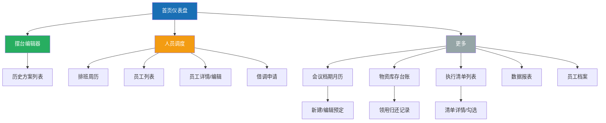
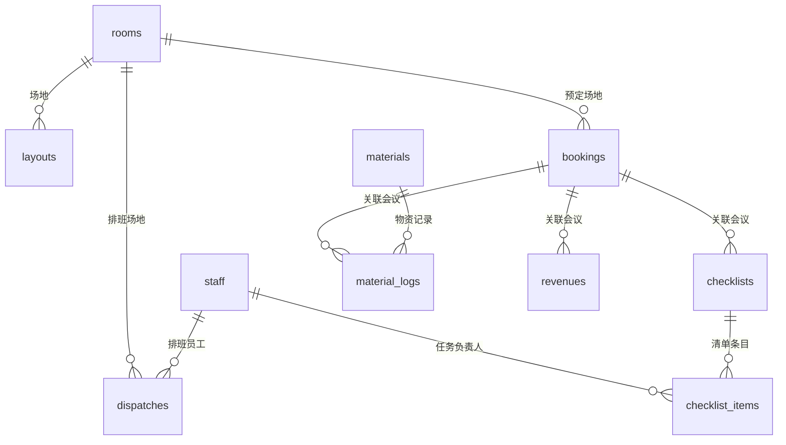

# 酒店会议管理小程序 — 信息架构文档 (IA)

> 项目：meeting-miniprogram  
> 日期：2026-05-25  
> 版本：v1.0  
> 平台：微信小程序（原生 WXML + WXSS + JS + 微信云开发）

---

## 1. 项目概述

**产品目标**：为酒店会议部门经理提供一站式内部管理工具，覆盖摆台设计、人员调度、档期管理、物资管控、执行清单与数据报表六大核心场景。

**目标用户**：酒店会议部门经理 / 宴会统筹主管（单人决策者角色）

**北极星指标**：经理能在 5 分钟内完成一场会议的完整筹备（摆台设计 → 人员排班 → 档期确认 → 物资准备 → 清单分配）。

**技术约束**：纯微信小程序原生，无 npm 包，所有后端逻辑走微信云开发（云函数 + 云数据库），数据绑定使用 `this.setData()`，尺寸单位使用 `rpx`（基准 750rpx）。

---

## 2. 站点地图 (Sitemap)



### TabBar 导航（4 项入口）

| Tab | 图标 | 对应页面 | 说明 |
|-----|------|----------|------|
| 首页 | 🏠 | `pages/index/index` | 仪表盘，聚合所有模块关键数据 |
| 摆台 | 📐 | `pages/layout/editor/index` | 核心功能 — 可视化摆台编辑器 |
| 调度 | 📋 | `pages/scheduling/calendar/index` | 排班周历 + 人员管理 |
| 更多 | ⋯ | `pages/more/index` | 网格菜单，收纳档期/物资/清单/报表 |

### 完整页面清单（13 页）

| # | 路径 | 页面名称 | 入口来源 |
|---|------|----------|----------|
| 1 | `pages/index/index` | 首页仪表盘 | TabBar |
| 2 | `pages/layout/editor/index` | 摆台编辑器 | TabBar |
| 3 | `pages/layout/history/index` | 历史方案 | 摆台编辑器 |
| 4 | `pages/scheduling/calendar/index` | 排班周历 | TabBar |
| 5 | `pages/scheduling/staff-list/index` | 员工列表 | 更多 / 排班页 |
| 6 | `pages/scheduling/staff-detail/index` | 员工详情 | 员工列表 |
| 7 | `pages/scheduling/dispatch/index` | 借调申请 | 排班页 |
| 8 | `pages/schedule/calendar/index` | 会议档期月历 | 更多 |
| 9 | `pages/schedule/booking/index` | 新建/编辑预定 | 档期月历 |
| 10 | `pages/materials/inventory/index` | 库存台账 | 更多 |
| 11 | `pages/materials/records/index` | 领用归还记录 | 库存台账 |
| 12 | `pages/checklist/list/index` | 执行清单列表 | 更多 |
| 13 | `pages/checklist/detail/index` | 清单详情（勾选） | 清单列表 |
| 14 | `pages/report/index/index` | 数据报表 | 更多 |
| 15 | `pages/more/index` | 更多入口 | TabBar |

---

## 3. 核心用户路径 (User Flows)

### Flow 1：创建一场新会议的完整流程（北极星路径）

```
首页 → 摆台编辑器 → 选择模板/手动拖拽 → 保存方案
  → 人员调度 → 按场地添加排班 → 确认人员
  → 更多 → 会议档期 → 新建预定（绑定客户+场地+时段）
  → 物资管理 → 查看库存 → 领用所需物资
  → 执行清单 → 从模板创建 → 分配任务到员工
  → 首页 → 查看倒计时提醒
```

### Flow 2：快速复用历史方案

```
首页 → 摆台编辑器 → 历史方案 → 浏览列表 → 选择方案 → 加载到画布 → 微调 → 保存为新方案
```

### Flow 3：临时借调人员

```
人员调度 → 排班周历 → 点击某天 → 查看已有安排 → 借调申请 → 填写场地/时段/原因 → 提交
```

### Flow 4：会前紧急检查

```
首页 → 倒计时提醒卡片（红色） → 点击进入清单详情 → 逐条确认任务状态 → 标记问题
```

### Flow 5：月底导出报表

```
更多 → 数据报表 → 查看使用率/效率/收入 → 一键导出 → 复制到剪贴板 / 保存图片到相册
```

---

## 4. 核心页面 — 内容模块清单

### 4.1 首页仪表盘 (`pages/index/index`)

| 模块 | 数据类型 | 交互行为 |
|------|----------|----------|
| 今日会议列表卡片 | 从 `bookings` 查询当天记录 | 点击跳转档期详情 |
| 会议倒计时提醒 | 距开始 < 2h 的会议标红 | 点击跳转执行清单 |
| 今日排班概览 | 从 `dispatches` 查询当天记录 | 点击跳转排班周历 |
| 库存预警列表 | 从 `materials` 查询 stock < minStock 项 | 点击跳转物资台账 |
| 待执行清单数量 | 从 `checklist_items` 统计未完成 | 点击跳转清单列表 |
| 本月收入汇总 | 从 `revenues` 按月聚合 | 纯展示 |

**空状态**：数据库无记录时，每张卡片显示"暂无数据"占位，引导用户前往对应模块创建。

---

### 4.2 摆台编辑器 (`pages/layout/editor/index`) — 核心页面

| 区域 | 模块 | 内容描述 |
|------|------|----------|
| 顶部栏 | 方案名称 | 可编辑文本，默认"未命名方案" |
| 顶部栏 | 场地选择 | 下拉选择 `rooms` 集合中的场地 |
| 左侧抽屉 | 家具库 | 9 种家具的图标+名称列表，点击创建 |
| 左侧抽屉 | 模板库 | 4 个预设模板按钮（剧场式/U型/课桌式/圆桌式） |
| 中心画布 | `movable-area` | 750×1000rpx 绘制区域，网格背景（20rpx 间距） |
| 中心画布 | `movable-view` | 每个家具一个实例，支持拖拽、选中 |
| 选中气泡 | 操作按钮 | 旋转90° / 复制 / 删除（仅选中时显示） |
| 底部状态栏 | 实时统计 | 座位数 N | 家具数 M |
| 底部状态栏 | 间距警告 | 两家具中心距 < 60rpx → 橙色条「间距过近」 |
| 底部操作栏 | 查看物料清单 | 弹出 Modal，按家具类型×数量展开物料配置表 |
| 底部操作栏 | 保存方案 | 收集所有家具座标 JSON → 云函数 `layout.save` |
| 底部操作栏 | 历史方案 | 跳转 `pages/layout/history/index` |

**空状态**：画布空白时，居中显示文字「点击左侧家具库开始摆台设计」引导提示。

---

### 4.3 排班周历 (`pages/scheduling/calendar/index`)

| 模块 | 内容描述 |
|------|----------|
| 周选择器 | 左右箭头切换周，显示"5月25日 - 5月31日" |
| 7 日网格 | 每列一天，每行一个场地，单元格显示当天排班人员姓名标签 |
| 场地分组 | 按 `rooms` 集合动态生成行 |
| 添加排班 | 浮动按钮 → 弹窗：选员工/场地/日期/时段 |
| 过滤逻辑 | 员工已在某天某场地有安排 → 列表中灰显不可选 |
| 重复警告 | 同一员工同天排到不同场地 → 橙色警告弹窗 |
| 借调入口 | 顶部「借调申请」按钮 → 跳转 dispatch 页 |

---

### 4.4 会议档期月历 (`pages/schedule/calendar/index`)

| 模块 | 内容描述 |
|------|----------|
| 月选择器 | 左右箭头切换月份，显示"2026年5月" |
| 月历网格 | 7×6 格子，每天显示日期数字 + 颜色圆点标注 |
| 颜色标注 | 灰色=空闲、黄色=部分占用、红色=满档 |
| 点击日期 | 展开底部面板，列出该天所有场地的预定详情 |
| 新建预定 | 浮动按钮 → 表单：场地/日期/时段/会议名称/人数/负责人/客户信息 |
| 冲突检测 | 同时段同场地已有预定 → 提交时云函数 `booking.checkConflict` 返回提示 |

---

### 4.5 物资库存台账 (`pages/materials/inventory/index`)

| 模块 | 内容描述 |
|------|----------|
| 列表项 | 物资名称、单位、当前库存、最低阈值、状态标签 |
| 库存预警 | stock < minStock → 红色高亮行 + 首页同步预警 |
| 搜索 | 顶部搜索框，按名称模糊搜索 |
| 领用按钮 | 弹窗：选领用人/数量/关联会议 → 云函数 `material.logLend` 自动扣减 |
| 归还按钮 | 弹窗：填归还数量 → 云函数 `material.logReturn` 自动补回 |
| 记录入口 | 底部「查看领用归还记录」→ 跳转 records 页 |

---

### 4.6 执行清单详情 (`pages/checklist/detail/index`)

| 模块 | 内容描述 |
|------|----------|
| 阶段分段 | 三个折叠区块：会前准备 / 会中保障 / 会后收尾 |
| 任务条目 | 每行：勾选框 + 任务内容 + 负责人姓名 + 状态标签 |
| 勾选交互 | 点击勾选框 → `checklist.updateItem` 实时同步到云数据库 |
| 问题标记 | 每行「有问题」按钮 → 弹出描述输入框 → `checklist.issues` 记录 |
| 问题汇总 | 顶部「查看所有问题」按钮 → 列出所有标记了 hasIssue 的条目 |
| 进度条 | 顶部显示"已完成 12/20" |

---

### 4.7 数据报表 (`pages/report/index/index`)

| 模块 | 内容描述 |
|------|----------|
| 场地使用率 | `report.roomUsage` 返回数据 → canvas 绘制柱状图 |
| 人员效率 | 表格：员工姓名 / 参与场次 / 总工时 |
| 月度收入 | 表格：月份 / 收入汇总，支持手动录入收入（弹窗表单） |
| 导出按钮 | 一键汇总文本格式 → `wx.setClipboardData` 复制到剪贴板 |
| 导出图片 | canvas 绘制报表快照 → `wx.canvasToTempFilePath` → 保存相册 |

---

### 4.8 更多入口 (`pages/more/index`)

| 模块 | 内容描述 |
|------|----------|
| 功能网格 | 4×2 宫格：会议档期 / 员工档案 / 物资管理 / 执行清单 / 数据报表 |
| 每格 | 图标 + 功能名称，点击 `wx.navigateTo` 跳转对应页面 |

---

## 5. 数据库集合关系



---

## 6. 云函数 Action 全集

| Action | 所属模块 | 说明 |
|--------|----------|------|
| `dbInit.init` | 初始化 | 创建 10 个数据库集合 |
| `layout.save` | 摆台 | 保存方案（含家具坐标 JSON + canvas 截图） |
| `layout.list` | 摆台 | 查询历史方案列表（分页） |
| `layout.get` | 摆台 | 获取单个方案详情 |
| `layout.delete` | 摆台 | 删除方案 |
| `staff.list` | 员工 | 查询员工列表 |
| `staff.add` | 员工 | 新增员工 |
| `staff.update` | 员工 | 更新员工信息 |
| `staff.delete` | 员工 | 删除员工 |
| `dispatch.add` | 排班 | 添加排班记录 |
| `dispatch.list` | 排班 | 查询排班（按周/按场地） |
| `dispatch.borrow` | 排班 | 借调申请 |
| `dispatch.stats` | 排班 | 出勤工时统计（按月/按员工） |
| `booking.create` | 预定 | 新建会议预定 |
| `booking.list` | 预定 | 查询预定（按月/按场地） |
| `booking.update` | 预定 | 更新预定信息 |
| `booking.delete` | 预定 | 删除预定 |
| `booking.checkConflict` | 预定 | 时间冲突检测 |
| `material.list` | 物资 | 查询库存列表 |
| `material.add` | 物资 | 新增物资 |
| `material.update` | 物资 | 更新物资信息（含修改库存） |
| `material.logLend` | 物资 | 领用记录 + 自动扣减库存 |
| `material.logReturn` | 物资 | 归还记录 + 自动补回库存 |
| `material.logs` | 物资 | 查询领用归还记录 |
| `checklist.createFromTemplate` | 清单 | 从模板创建执行清单 |
| `checklist.list` | 清单 | 查询清单列表 |
| `checklist.updateItem` | 清单 | 更新任务条目状态（勾选/取消） |
| `checklist.issues` | 清单 | 查询所有问题记录 |
| `report.roomUsage` | 报表 | 场地使用率统计 |
| `report.staffEfficiency` | 报表 | 人员效率统计 |
| `report.revenue` | 报表 | 月度收入录入与汇总 |
